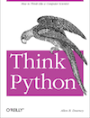

# Learn Python

Read Allen Downey's [Think Python](http://www.greenteapress.com/thinkpython/) for getting up to speed with Python 2.7 and computer science topics. It's completely available online, or you can buy a physical copy if you would like.

<a href="http://www.greenteapress.com/thinkpython/"></a>

For quick and easy interactive practice with Python, many people enjoy [Codecademy's Python track](http://www.codecademy.com/en/tracks/python). There's also [Learn Python The Hard Way](http://learnpythonthehardway.org/book/) and [The Python Tutorial](https://docs.python.org/2/tutorial/).

---

###Q1. Lists &amp; Tuples

How are Python lists and tuples similar and different? Which will work as keys in dictionaries? Why?

>> Tuples and lists are different in that tuples are not mutable. They are immutable, which is to say unchangeable. Lists, on the otherhand, are changeable. You can remove elements , and you can add them. 

>> They are similar in that they both have an order can be iterated through and indexed. You can return the n[th] item in both a list and a tuple. 

>> Another difference is that tuples are meant to be heterogeneous, and lists are meant to be homogenous. Tuples are heterogeneous insofar as the items in the list are not of the same type. If you have 2 items in a tuple, one could be the line of a page, and the other could be a page number. However, If you had a series of page numbers, elements of the same type, you would probably use a list. This is a semantic difference. So an index in a tuple has an implied semantic. The point of a tuple is that the i-th slot means something specific.

---

###Q2. Lists &amp; Sets

How are Python lists and sets similar and different? Give examples of using both. How does performance compare between lists and sets for finding an element. Why?

 
>>Sets are different from tuples and lists in that they only contain unique elements. Furthermore, they are unordered, and can’t be indexed. Sets can’t contain mutable objects (like lists), but they are mutable. Also, to check a set is much faster than to check a list. 

>>Sets are faster than lists when checking membership, especially when they are long. This is because sets are implemented as a hashtable, whereas lists are dynamic arrays. It’s this difference which makes it such that sets have no order while lists do. 
A hash table is a list of associations, where an element in an array is passed through the hash function and assigned to a specific spot in the hash table. When you iterate through a set, the set knows where to look because that item has an associated slot and is indexed there and if it is in the set it would be in that slot.

>>With a list, which is a dynamic array, each spot has to be looked at to see if it has the element we are looking for, which is much slower. 
With a list, worse case scenario, you look at all items in the list, O(n), where n is the amount of items in the list. With a set, worse case scenario you look in just one spot, so O(1).

---

###Q3. Lambda Function

Describe Python's `lambda`. What is it, and what is it used for? Give at least one example, including an example of using a `lambda` in the `key` argument to `sorted`.

>> The lambda operator acts as a throwaway function. It’s meant to serve an immediate purpose and act as a quick function. 
It has the form:
`lambda x, y : x + y`
this would give x + y for values x and y. 
An example using it as the 'key' argument to 'sorted' would be:
```
student_tuples = [
        ('henry', 'A', 15),
        ('sue', 'B', 12),
        ('fred', 'B', 10),
]
sorted(student_tuples, key=lambda student: student[2])
[('fred', 'B', 10), ('sue', 'B', 12), ('henry', 'A', 15)]
```
In this example, sorted took the list student_tuples, and passed it under the lambda, which was that for each item in the list, the [2] index would be returned, and that element would then be the thing being sorted, the key. In this case that element is the age, so we have sorted the list by age. 


---

###Q4. List Comprehension, Map &amp; Filter

Explain list comprehensions. Give examples and show equivalents with `map` and `filter`. How do their capabilities compare? Also demonstrate set comprehensions and dictionary comprehensions.

>> ####List Comprehension
>> A list comprehension is convenient way to make a list. It loops through a certain parameter or set of parameters, such as a range of numbers or another list, and populates the list based on what you decide you want to insert, for each item in that list or range. You can also make the population of the new list conditional.

>>`squares_to_10 = [x**2 for x in range(11)]`

>>`squares_to_10 = [x**2 for x in range(11) if x % 2 !=0]`
>>
The last code squares all those items in range 11 that are not even. 
To achieve the same result we would have to do `list(map((lambda x: x**2), filter(lambda x: x % 2 != 0, range(11))))`
So a list comprehension seems to make more sense when you have both conditions and functions you want to implement. 

>>####Dict + Set Comprehension
Dictionaries have their own list comprehension. Here is an example of making a dictionary with dictionary comprehension:
```
D = {x: x**2 for x in [1,2,3]}
{1: 1, 2: 4, 3: 9}
```

>>If you have 2 lists, and want to make them into a dictionary, you can use zip with dictionary comprehension
```
l1 = ['apple', 'pear']
l2 = ['red', 'green']
D = {l1:l2 for l1,l2 in zip(l1,l2)}
print D
{'pear': 'green', 'apple': ‘red'}
```

>>Set comprehensions work the same way as list comprehensions, but with braces instead of brackets. If you wanted a set of the squares of integers 1-10, you would do:
`x = {i**2 for i in range(10)}`

---

###Complete the following problems by editing the files below:

###Q5. Datetime
Use Python to compute days between start and stop date.   
a.  

```
date_start = '01-02-2013'    
date_stop = '07-28-2015'
```

>> 937 days, 0:00:00

b.  
```
date_start = '12312013'  
date_stop = '05282015'  
```

>> 513 days, 0:00:00

c.  
```
date_start = '15-Jan-1994'      
date_stop = '14-Jul-2015'  
```

>> 7850 days, 0:00:00  

Place code in this file: [q5_datetime.py](python/q5_datetime.py)

---

###Q6. Strings
Edit the 7 functions in [q6_strings.py](python/q6_strings.py)

---

###Q7. Lists
Edit the 5 functions in [q7_lists.py](python/q7_lists.py)

---

###Q8. Parsing
Edit the 3 functions in [q8_parsing.py](python/q8_parsing.py)


