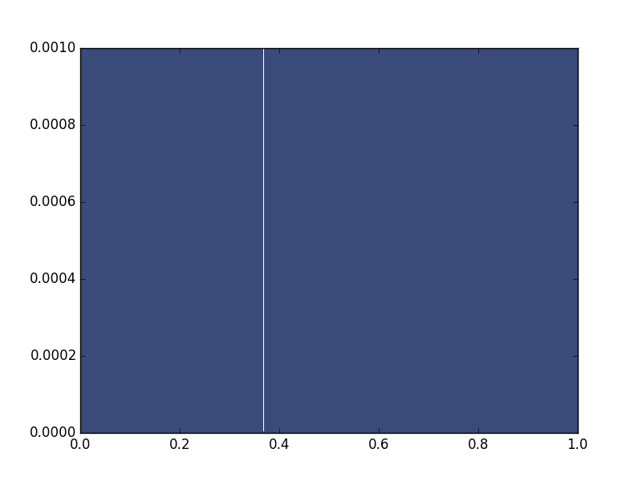
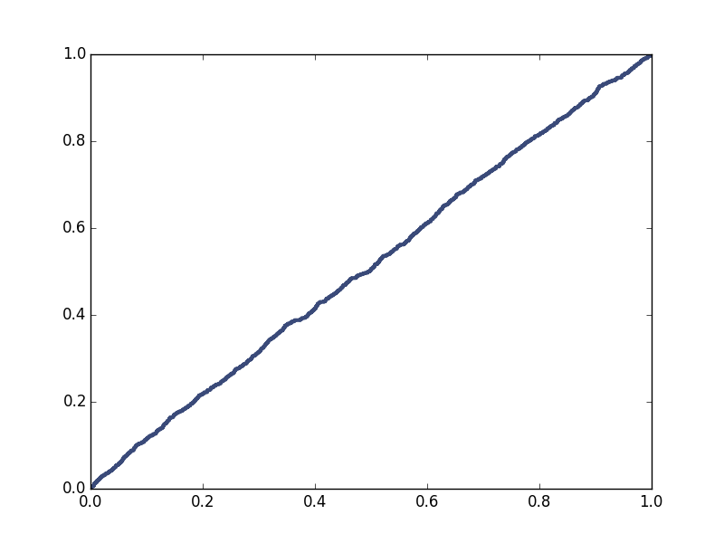

[Think Stats Chapter 4 Exercise 2](http://greenteapress.com/thinkstats2/html/thinkstats2005.html#toc41) (a random distribution)

>> The random numbers occured in general at uniform distribution. The pmf was very hard to read with so many numbers, but it did show some overlap. The Cdf was a better indicator, and it showed a steady slope from 0 to 1.0, indicating that there were few numbers that were repeated or in a clustered range. 


```
import numpy as np
import thinkstats2

thousrand = np.random.rand(1000)


import thinkstats2
pmf = thinkstats2.Pmf(thousrand)


pmf_thou = thinkstats2.Pmf(thousrand)
thinkplot.Pmf(pmf_thou)
thinkplot.Show()

cdf_thou = thinkstats2.Cdf(thousrand)
thinkplot.Cdf(cdf_thou)
thinkplot.Show()
```






